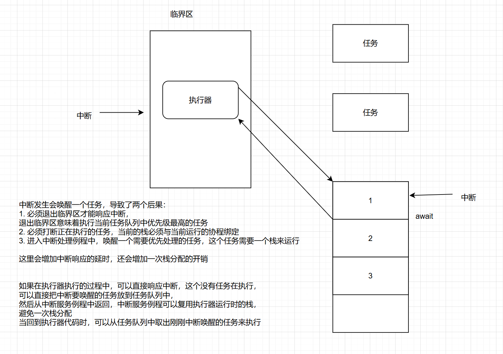

# 2025-2-21

### 1、问题

在《设计报告》中**“如何让中断程序知道当前在执行那部分代码”**提到的设计思路，会将**执行器代码放入临界区**，让其不可被打断，所有的中断都将在执行的任务代码时产生，这会**导致抢占的中断都可以无脑分配一个栈给当前任务**，用来保存当前上下文。

而且这种设计的潜在问题是实时性可能受到影响，因为调度器代码执行期间中断被禁用，高优先级的中断可能会被延时处理

假设，现在在执行一个协程任务的代码，然后await释放控制权，先会去执行调度器的代码，如果此时产生中断，要想响应中断必须唤醒一个任务，导致两个后果：

- 必须退出调度器的临界区才能响应中断，是否意味着需要唤醒一个任务？
- 如果当前就绪队列有更高优先级的任务，会打断当前正在执行的任务

### 导师建议

如果在执行器执行的过程中，可以直接响应中断，这时没有任务在执行，可以直接把中断要唤醒的任务放到任务队列中，然后从中断服务程序中返回，中断可以复用执行器运行时的栈，避免一次栈分配，当回到执行器代码时，可以从任务队列中取出刚刚中断唤醒的任务来执行

我的思考：

**1、我认为如果调度器是在临界区执行，并不会增加栈分配的开销，或者说这部分栈开销是不可避免的。分析如下：转去执行调度器代码的两种情况**

- 协程任务await释放控制权，转去执行调度器的代码。如果此时产生中断，会唤醒一个任务，为响应中断会分配一个栈去保存中断上下文，该任务的程序栈则是去复用共享栈。
- 闹钟到达，有更高优先级任务加入就绪队列，会去执行调度器代码。如果此时产生中断，首先打断当前任务，去执行这个高优先级任务，实现抢占，然后响应中断。因为这是抢占刚才的任务，会分配一个栈给之前的任务去保存上下文，然后会再给高优先级任务分配一个栈去保存中断上下文

个人认为上述两个情况的中断栈的开销是不可避免的

**2、至于调度器代码全是在临界区里的问题**

（3.3号）后续补充：调度器代码并不全是都在临界区中，而是只要确保调度器的以下过程不被中断：

- 修改位图将任务退出就绪队列
- 寻找位图中的最高优先级
- 设置调度器中 `OSCurPrio`、`OSCurTCB` 为最高优先级

**3、“在执行调度器代码产生中断能立刻执行，并在中断中去唤醒任务”**

> 实则任务的唤醒即加入就绪队列是依赖于两种方式，一是原本await的任务延时到达，此时会产生一个闹钟的中断，会去执行该任务的Waker，将该任务加入就绪队列；二是调度器去将任务加入就绪队列

（3.3号）后续补充：个人分析，如果去中断中去唤醒任务，那么至少需要完成上面第2个问题的三步；另外就是如何区分中断此时是在那部分代码，是调度器还是任务代码

**4、中断可以复用执行器运行时的栈，避免一次栈分配**

> 需要验证一下可行性

后续补充：在OS初始化的时候就已经给中断分配了一个中断栈

当一个任务await之后，进入调度器的代码，此时已经将该任务在位图修改为非就绪态，在查找下一个任务时，产生闹钟中断来了个更高优先级的任务，但此时的当前任务优先级仍为上一个任务，产生抢占，那么抢占的上下文应该保存在哪

### 2、复现测试结果

测试报告提到，对系统的测试是通过拉低拉高GPIO口，来测量其持续时间。需要用到示波器

### 3、关于embassy测试结果

在测试报告中关于embassy的delay测试，发现embassy的delay时间平均值达到94ms（delay设置为50ms），而且测试组的结果在107ms和85ms跳变，一般情况下，同一延时时间实际延时应该一致才对，所以需要分析一下照成embassy延时不一致的具体原因

猜测：测试组的结果不是107ms就是85ms，可能是由于 embassy 不具备抢占导致的。例如，当异步任务延时到达时正好运行着其他任务，不得不等待当前任务以及就绪队列的其他靠前任务
