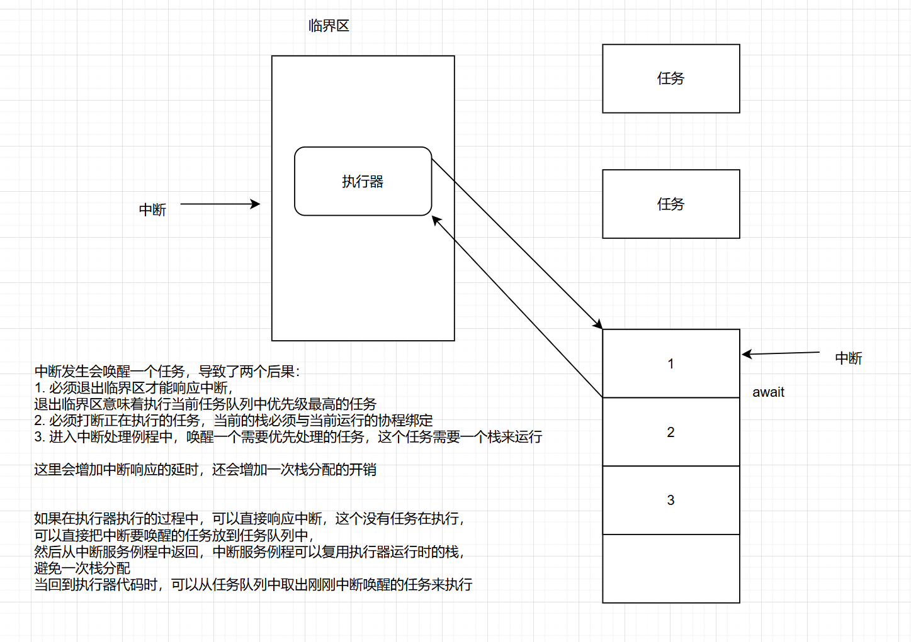

# 2025-2-21

### 1、问题

在《设计报告》中**“如何让中断程序知道当前在执行那部分代码”**提到的设计思路，会将**执行器代码放入临界区**，让其不可被打断，所有的中断都将在执行的任务代码时产生，这会**导致抢占的中断都可以无脑分配一个栈给当前任务**，用来保存当前上下文。

而且这种设计的潜在问题是实时性可能受到影响，因为调度器代码执行期间中断被禁用，高优先级的中断可能会被延时处理

假设，现在在执行一个协程任务的代码，然后await释放控制权，先会去执行调度器的代码，如果此时产生中断，要想响应中断必须唤醒一个任务，导致两个后果：

- 必须退出调度器的临界区才能响应中断，是否意味着需要唤醒一个任务？
- 如果当前就绪队列有更高优先级的任务，会打断当前正在执行的任务

### 导师建议

如果在执行器执行的过程中，可以直接响应中断，这时没有任务在执行，可以直接把中断要唤醒的任务放到任务队列中，然后从中断服务程序中返回，中断可以复用执行器运行时的栈，避免一次栈分配，当回到执行器代码时，可以从任务队列中取出刚刚中断唤醒的任务来执行

### 2、复现测试结果

测试报告提到，对系统的测试是通过拉低拉高GPIO口，来测量其持续时间

### 3、关于embassy测试结果

在测试报告中关于embassy的delay测试，发现embassy的delay时间平均值达到94ms（delay设置为50ms），而且测试组的结果在107ms和85ms跳变，一般情况下，同一延时时间实际延时应该一致才对，所以需要分析一下照成embassy延时不一致的具体原因

猜测：测试组的结果不是107ms就是85ms，可能是由于 embassy 不具备抢占导致的。例如，当异步任务延时到达时正好运行着其他任务，不得不等待当前任务以及就绪队列的其他靠前任务

# 2025-3-7

#### 明确下一步目标

目前 `ucosii` 重写的功能模块较为分散，各模块依赖比较强，核心功能耦合度较高

- 将 `embassy_preempt` 模块化，降低耦合度
  - 可以参考 Embassy 的项目结构，优化 `embassy_preempt` 的模块化结构
  - 可以先将调度器与时钟驱动模块分离出来

- 同时解决异步调度器遗留的两个问题
  - 时间戳更新过慢
  - PenSV多余的上下文保存

