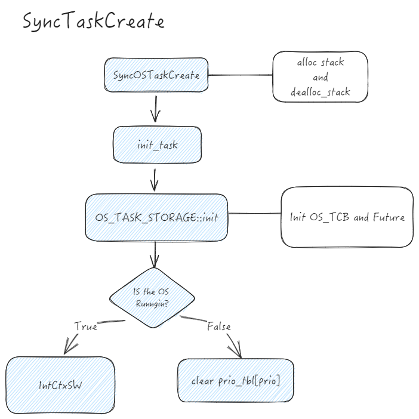
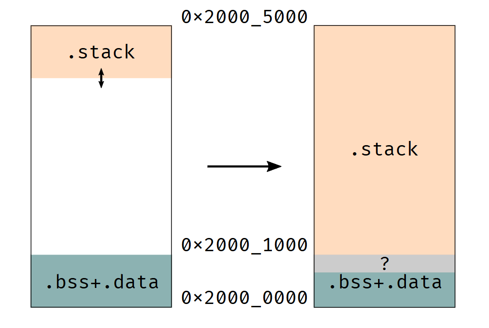
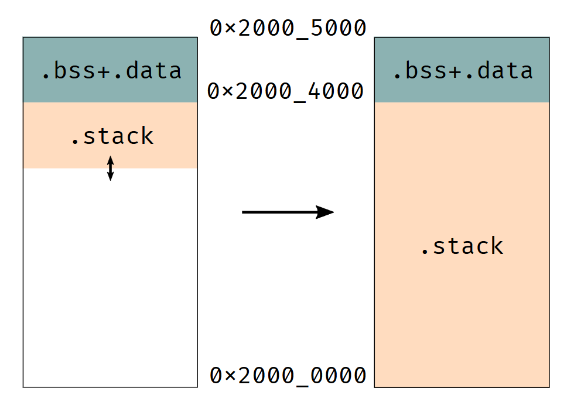

## 命令

```
cargo run --bin "sync_time_performance" --release --features "alarm_test","stm32f401re"
```

编译+烧录+defmt日志输出：完全依赖于probe-rs以及cargo的包管理，实际执行`probe-rs run --chip STM32F401RETx`。工具链`thumbv7em-none-eabi`编译后，通过probe-rs的核心库`cargo-flash`将固件烧录到目标设备。


- `probe-rs`用于嵌入式开发的现代化调试工具库，专注于通过调试探针（如` J-Link`、`ST-Link`、`CMSIS-DAP` 等）与目标设备进行交互( ARM 和 RISC-V )。它提供了一个跨平台的 Rust 库和命令行工具，支持芯片编程、调试和内存访问等操作。


# 代码分析

## stack_allocator.rs

实现了一个**栈分配器**，用于动态分配和管理任务栈和中断栈

```rust
pub struct OS_STK_REF {
    pub STK_REF: NonNull<OS_STK>,
    pub HEAP_REF: NonNull<u8>,
    pub layout: Layout,
}
```

- `STK_REF`: 栈的引用（指向栈的顶部或底部）。
- `HEAP_REF`: 栈内存的起始地址。
- `layout`: 栈的内存布局（大小和对齐方式）。


### 分配栈

```rust
pub fn alloc_stack(layout: Layout) -> OS_STK_REF {
    let heap_ptr: *mut u8;
    unsafe {
        heap_ptr = STACK_ALLOCATOR.alloc(layout);
    }
    stk_from_ptr(heap_ptr, layout)
}
```

- 调用 `STACK_ALLOCATOR.alloc(layout)`，分配一块内存。
- 使用 `stk_from_ptr` 将分配的内存转换为 `OS_STK_REF` 结构


### 释放栈

```rust
pub fn dealloc_stack(stk: &mut OS_STK_REF) {
    if stk.STK_REF == NonNull::dangling() || stk.HEAP_REF == NonNull::dangling() {
        return;
    }
    let stk_ptr = stk.HEAP_REF.as_ptr();
    stk.STK_REF = NonNull::dangling();
    stk.HEAP_REF = NonNull::dangling();
    unsafe {
        STACK_ALLOCATOR.dealloc(stk_ptr, stk.layout);
    }
}
```


### STACK_ALLOCATOR

其实可以看到，对于任务栈的分配都基于 `STACK_ALLOCATOR` 这个全局变量。其类型为`FixedSizeBlockAllocator`

```
pub struct FixedSizeBlockAllocator {
    list_heads: [Option<&'static mut ListNode>; BLOCK_SIZES.len()],
    fallback_allocator: Heap,
}
```

- `list_heads`：空闲链表池，维护不同大小的内存块。当任务请求栈空间时，首先尝试从这里分配。
- `fallback_allocator`：底层的 `Heap` 结构，作为备用分配器。当空闲链表无法满足分配需求时，从 `Heap` 申请新内存


#### STACK_ALLOCATOR.alloc

- 通过 `Layout` 计算任务栈所需的大小，并在 `BLOCK_SIZES` 中找到最匹配的索引
- 如果对应索引的空闲链表中有可用内存块，则直接取出链表头，并将 `next` 指向的块作为新的链表头。
- 如果该索引的链表为空，说明此前没有相应大小的块可用，需要调用 `fallback_alloc`，从 `Heap` 中申请新栈空间。


### STACK_ALLOCATOR.dealloc

**确定回收的空闲链表**

- 依据 `Layout` 计算待释放内存块的大小，找到最匹配的链表索引

**构造新的空闲块节点**

- 在释放的内存块上创建一个 `ListNode`，让它的 `next` 指向当前的空闲链表头.这样，新回收的块会被插入到链表的最前端，方便下次分配时快速取用
- 通过 `ptr` 将当前指针转换为 `ListNode`，并写入新创建的 `ListNode` 结构，最终完成回收操作

**更新空闲链表头**

- 最后将链表头设置为新Node


## arena.rs

实现了一个 **基于固定大小的内存池分配器**（`Arena`），

```
pub struct Arena<const N: usize> {
    buf: UnsafeCell<MaybeUninit<[u8; N]>>,
    ptr: Mutex<Cell<*mut u8>>,
}
```

- `buf`：内存缓冲区
  - `MaybeUninit` 表示数据未初始化，避免触发未初始化数据的未定义行为
- `ptr`：一个指针，用于标记当前内存分配的起始地址

一个静态内存池分配器，用于分配任务栈内存

​		

​		发现 `OS_TASK_STORAGE` 是通过 `Arena` 来分配， `OS_TASK_STORAGE` 存储着 `OS_TCB` 和 `future`，这是两个关键成员， `OS_TCB` 存储着任务的完整信息，`future` 指向该任务通过 `async` 修饰之后返回的 `Future` 。




# executor调度器


## waker.rs

`waker.rs` 主要用于实现异步任务的唤醒器（Waker），它与 `Future` 协同工作，确保任务能够在合适的时机被重新调度执行。

在执行异步任务时，如果任务无法立即完成，通常会被**挂起**，并存储一个 `Waker`。当条件满足时，`Waker` 会被调用，以唤醒任务并重新调度它的执行。

- 定义 `clone`、`wake`、`drop` 回调函数，用于管理 `Waker` 的生命周期。

- 这些回调函数被封装在 `RawWakerVTable` 虚表中，实现对 `RawWaker` 结构的具体行为定义。
- 通过 `Waker::from_raw(RawWaker::new(p.as_ptr() as _, &VTABLE))`，可以从任务创建一个 `Waker`，用于后续唤醒操作。


## atomic

在异步环境下，多个任务可能会并发访问同一资源，因此需要安全地进行同步操作，而不使用锁（以减少性能开销）。`atomic` 通过 `core::sync::atomic::{compiler_fence, AtomicBool, AtomicU32, Ordering}` 提供了一组原子操作，允许在多线程环境中安全地访问共享数据。


## compiler_fence

`compiler_fence` 是 Rust 标准库中的一个函数，用于在编译时插入内存屏障，它的作用是防止编译器对代码进行某些优化，从而确保内存操作的顺序符合预期。

用于控制内存操作的顺序。在多线程或并发编程中，编译器和处理器可能会对代码进行优化（如指令重排序），这可能导致内存操作的顺序与代码编写的顺序不一致。内存屏障可以防止这种重排序，确保内存操作的顺序符合预期。

`compiler_fence` 是一种编译器内存屏障，它不会生成任何硬件指令，但会阻止编译器对代码进行重排序。

- `Ordering::Relaxed`：最弱的内存顺序，仅保证原子操作本身是原子的。
- `Ordering::Acquire`：确保后续的加载操作不会被重排序到屏障之前。
- `Ordering::Release`：确保前面的存储操作不会被重排序到屏障之后。
- `Ordering::AcqRel`：结合了 `Acquire` 和 `Release` 的特性。
- `Ordering::SeqCst`：最强的内存顺序，确保所有线程看到的操作顺序一致。


## timer_queue.rs

在原本的ucosii中，一次SystemTick触发一次中断，在中断中会遍历TCB链表，将设置好的TCB成员OSTCBDly减一，如果为零则加入就绪队列

但在该项目中，采用的是时钟队列，一个维护 `TimerQueue` 实例，包括成员head表示队列的头保存一个指向 `OS_TCB_REF`的 `Option`，用于标识队列的首任务，成员 `set_time` 表示队列中任务的下一到期时间，即最近需加入就绪队列的时间

时钟队列的核心是 `Alarm` ，一旦异步任务通过OSTimeDly主动释放控制权，会在该任务的 `OS_TCB`设置过期时间，并设定一个闹钟，而且会将该任务的 `Waker`注册到闹钟里，当 `Alarm` 到达，执行注册的 `Waker` ，实现将该任务唤醒


## flip-link

Rust 程序在存在栈溢出的情况下可能不具备内存安全性。而fliplink为嵌入式程序添加零成本堆栈溢出保护

ARM Cortex-M 程序在 RAM 中的默认内存布局如下所示：




当栈生长到`.bss`和`.data`段，会导致静态变量被不相关的数据覆盖。这可能导致程序观察到静态变量处于无效状态

解决方案是改变程序的内存布局，并将栈放置在 `.bss+.data` 区域下方:



### 安装

```
cargo install flip-link
```

但我在安装时报错了，所以源码安装

```
curl --proto '=https' --tlsv1.2 -LsSf https://github.com/knurling-rs/flip-link/releases/download/v0.1.9/flip-link-installer.sh | sh
```


### 使用

本身就是一个链接器，通过修改编译参数来添加

```
rustflags = [
  "-C", "linker=flip-link", # <- add this
  # (..)
]
```

`knurling-rs`、`defmt`、`probe-run`均依赖`flip-link`


## 调度

### alarm_callback

- 处理过期的任务，移出time_queue，加入就绪队列
- 更新set_time
- 并重新设置set_alarm唤醒时钟
- 调用IntCtxSW


### IntCtxSW

- find_highrdy_prio找到最高优先级

- 调用interrupt_poll


### interrupt_poll

- 判断当前任务是否IDLE任务，不是则标记为被中断，不允许调度
- 获取最高优先级任务，判断堆栈是否为空，为空则需要分配堆栈
  - **空闲任务不需要单独分配栈**，直接使用 `PROGRAM_STACK` 的预定义堆栈空间
  - 不是空闲任务则调用 `alloc_stack` 分配新任务的堆栈
- 随后调用OSTaskStkInit初始化任务堆栈
- 调用restore_thread_task恢复最高优先级任务（实质是触发PenSV异常）


### poll

```
RTC_DRIVER.set_alarm_callback(self.alarm, Self::alarm_callback, self as *const _ as *mut ());
```

当RTC设定的时间一到则调用alarm_callback，执行以上逻辑


### delay_tick

- 设置当前任务的过期时间为 `当前时间`+`tick`
- 移出就绪队列，加入时钟队列等待唤醒
- 判断时钟队列的set_time与next_expire的大小
- 设置闹钟，如果设置不成功（定时器的过期时间已经到达）则移出过期任务，重新设置next_expire
- 根据位图更新最高优先级及TCB，如果当前任务不是最高优先级则调用`interrupt_poll`


### time_driver

`init`配置TIM3，启用捕获中断和溢出中断，TIM3为 100_000 Hz，ARR设置为65535，CRR设置为32768，捕获中断和溢出中断均会执行`next_period`函数，实质就是每隔0.32768s

??period类型为u32，是否会溢出

然后 `period<<15+count` 为当前时间的事件戳。三个闹钟对应着TIM3的2、3、4通道，通过开关通道的中断来实现对闹钟的开关。设置闹钟，就是设置通道的CCR值，当到达时会触发中断，中断里会判断哪个闹钟（通道）触发，会调用该闹钟的Waker回调函数，对任务进行唤醒


## PenSV

- 上来直接保存上下文到PSP
- 如果最高优先级跟当前优先级一致，则恢复上下文（这两步是否有点鸡肋，是否可以直接判断然后返回）
- 获取最高优先级的栈引用，然后将其放入`PROGRAM_STACK`程序栈，并弹出原本的旧栈指针到`old_stk`
- 判断当前任务是否在线程池，如果不在则需要保存上下文，即将PSP值放入`old_stk`的栈引用里，并设置当前TCB的栈为`old_stk`
  - 如果在线程池但如果堆指针与新栈的堆指针不一致，则销毁旧栈（猜测因为堆指针不一样，则说明栈的区域不一致，需要销毁）
  - 在线程池，且堆指针一致，则忽略旧栈（猜测为了避免旧栈复用时销毁旧栈区域）

- 恢复高优先级任务的上下文


### 延时有20us的误差


