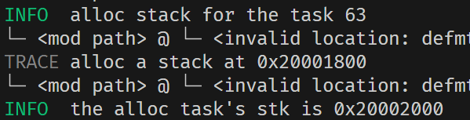
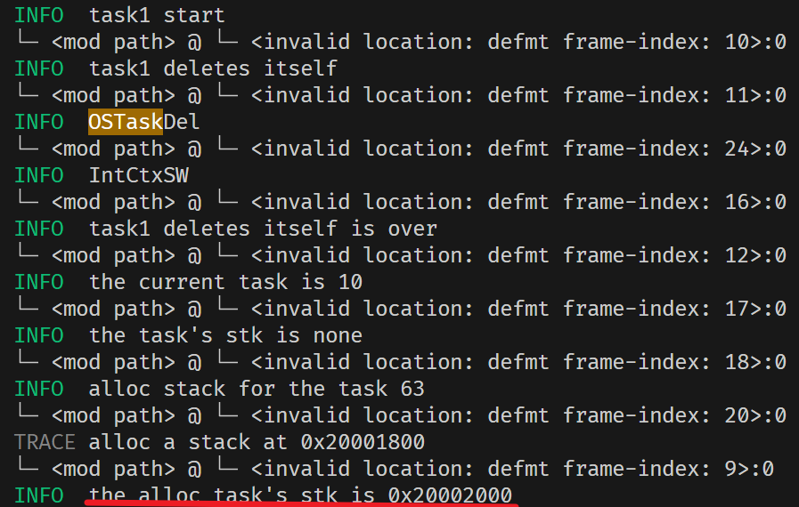
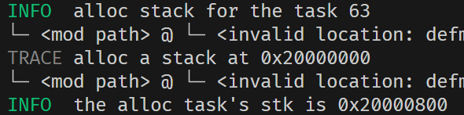
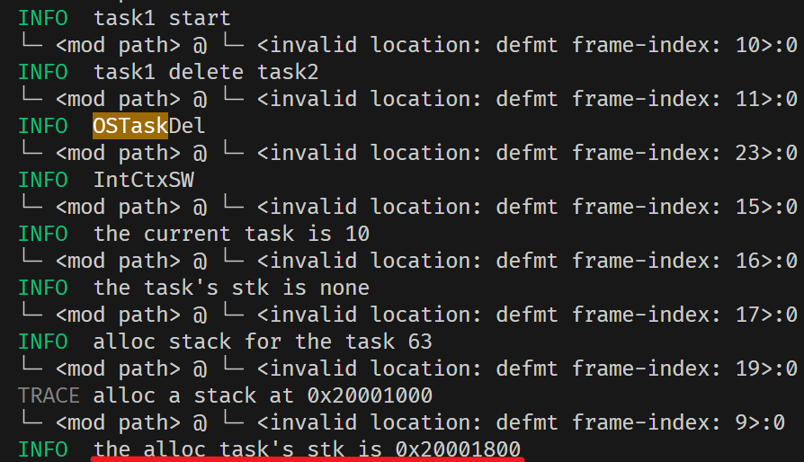
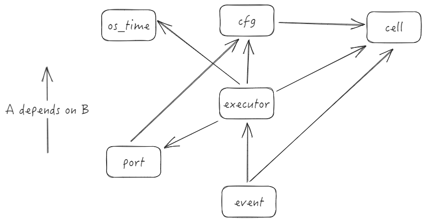

# 周报

​	

## 3-10 ~ 3-14

有个棘手的问题，个人理解组件化是将调度器内核最小化，以至于最小化都能运行，后面进行扩展也只需要添加新的组件。但是对于RTOS来说，或者对这个项目来说，功能上已经相对完善，耦合性也较高。需要依赖堆栈的内存分配去管理任务栈，依赖定时器实现时钟戳以及闹钟，依赖时钟队列管理延时任务等。

组件化在于如何在最小化内核的同时，仍然保持系统的可扩展性和模块的独立性

这一阶段计划：

- 将内核最小化，分离与内核关联不大的代码，以组件的形式独立。
  - 不再采用ucosii的代码结构
- 目前仅支持stm32f401，需要往多处理适配
  - 启动内核外设方式不同，需要统一接口
  - 需要解决memory.x链接脚本问题
  - 时钟问题，定时器是由系统时钟提供的时钟信号，需要确定每款芯片的时钟


Qemu去验证不同芯片下的可行性

​	

### memory.x解决方案

因为不同芯片有不同大小的FLASH和RAM，所有链接器所需要的 `memory.x` 也不同。有两种方案：

- 根据芯片类型去生成对应的`memory.x`，就跟embassy一样，embassy-stm32的构建脚本build.rs，会识别用户传过去的`feature`去生成 `memory.x` 。
- 另一种就是用户自行添加所用芯片的 `memory.x` 

但我看到`stm32-metapac`提供接口，可以自动生成`memory.x`，原理应该第一种差不多

但目前我没有去验证其他芯片，是否会正确生成

​	

### Question


https://rustcc.cn/article?id=04fbf832-0395-49dc-ab60-ef4496a34060

在一个 `no_std` 环境中使用了 `panic = "unwind"`，而 `no_std` 环境不支持栈展开（unwinding）。Rust 的标准库 (`std`) 提供了栈展开的支持，但在 `no_std` 环境中，默认情况下只能使用 `panic = "abort"`

设置 `panic = "abort"`：

```
[profile.dev]
panic = "abort"

[profile.release]
panic = "abort"
```

但是没必要，这里报错归根到底是因为我cargo build没有指定平台 `thumbv7em-none-eabi` 导致的，会配置隐式地支持 `panic = "abort"`

​	

## 3-17 ~ 3-21

目前已经大致完成芯片架构扩展，不再单一支持F401

#### 时钟树配置

RCC的初始化需要对锁相环PLL配置，但纵使所有芯片的HSE都为8M，一旦需要的系统时钟不同，那么PLL锁相环参数M、N、P、Q也是不同的。

目前，尚未实现统一的接口来抽象时钟树配置。与 **Embassy** 等框架提供的完整 STM32 外设接口相比，需要手动配置时钟树

用于定义内存布局`memory.x` 通过 **stm32metapac** 提供的接口动态生成 `memory.x`，确保其与目标芯片的内存布局一致。

#### 定时器

定时器，需要解决的是如何获取系统时钟。然而，**stm32metapac** 并未像 **stm32-hal** 那样提供直接获取时钟频率的接口。为了解决这一问题，设计了专用的函数来计算 `SYSCLK` 和 `APB` 总线的时钟频率。会在os初始化时被调用，以确保定时器能够基于正确的时钟频率运行

另外像 `embassy` 那样支持了通过 `feature` 设置定时的脉冲频率

#### 外设接口

为了支持更多 STM32 芯片，激活 **stm32metapac** 的关于芯片的 `feature` 实现。编译时启用特定芯片的 `feature`，可以动态加载对应芯片的外设寄存器定义和访问接口。

​	

同时展开对ucos底层函数的重写

#### 全局分配器（Global Allocator）的实现

在之前的实现中，系统并不支持像`String`，`Vec`这种动态大小的类型。需要完成 `global allocator` 的实现。

之前实现栈分配器的时候，也是对堆内存进行分配。采用的是 linked list allocator 链式分配器的方案来管理堆内存。链式分配器通过维护一个空闲内存块的链表，动态分配和释放内存。

由于使用了 `flip-link` 链接器，`.data` 和 `.bss` 段被放置在地址空间的高位，所以可以在任务栈之后开辟了一块专用的堆内存区域，供全局分配器使用


另外完成了部分关于ucos中os_core和os_task的重写工作

​	

## 3-24 ~ 3-28

本周主要完成 ucosii 中全局变量的设置以及对os_core、os_task、os_time中的部分函数进行重写。


### 全局变量

- `OSIntNesting`，中断嵌套数
- `OSLockNesting`，调度锁的个数

为了能对调度器进行加锁以及避免中断嵌套中切换任务，`ucosii` 其实是通过`OSIntNesting`和`OSLockNesting`两个全局变量完成的。`OS_Sched`会去判断这两个变量是否为0，都为0时才会去调度新的任务。`ucosii` 是通过SysTick中断每隔几ms去检查优先级位图是否需要进行切换，也就是不断轮询看是否切换，但是 `embassy_preempt` 整个调度过程是线性的，因为引入了rust的协程以及事件唤醒机制。如果像 `ucosii` 一样直接在调度器代码中根据这两个全局变量判断是否切换的话，可能不太现实。在调度器代码中加入调度锁，代码就大概率不会往下运行，因为调度器是线性执行的，它必须确保能切换到任务。

换个思路，一般使用调度锁，是不想被其他任务打断。也就是说，在任务运行中，有更高优先级的任务被唤醒，调用了闹钟的回调函数，加入了就绪队列，按以往不加锁的话会通过 `IntCtxSW` 判断优先级是否高于当前优先级，后续会转入调度器代码，切换到最高任务。那么是否可以直接在 `IntCtxSW` 中引入调度锁，不必像 `ucosii` 一样在轮询方式的调度器内核中加入调度锁。这样不会导致os卡死，加锁后仍然可以用过解除调度锁来通过` IntCtxSW` 再次进入调度器代码中。

#### 验证

配置两个任务，task1优先级位11，task2优先级为10，task1任务体中有一个延时操作（延时函数只是用汇编写的循环，并不会主动释放控制权）

```
fn task1(_args: *mut c_void) {
    loop {
        // OSSchedLock();
        #[cfg(feature = "alarm_test")]
        info!("task1");
        delay(4);   // 2s
        #[cfg(feature = "alarm_test")]
        info!("task1 over");
        // OSSchedUnlock();
        OSTimeDlyHMSM(0, 0, 0, 500);
    }
}

fn task2(_args: *mut c_void) {
    loop {
        #[cfg(feature = "alarm_test")]
        info!("task2");
       
        OSTimeDlyHMSM(0, 0, 0, 500);
    }
}
```


下图是没有添加调度锁的日志输出：


可以看到，最初在执行IDLE任务，然后优先级11（task1）的任务被唤醒，进行一系列上下文切换过程。然后执行task1任务体的内容，直到红框部分，这标志此时有一个任务被唤醒，而且它的优先级为10（task2），它直接打断优先级11（task1）的任务，进行优先级抢占。


下图是在task1任务中添加调度锁的日志输出：


仍然是之前的场景，先在执行IDLE任务，然后优先级11（task1）的任务被唤醒。然后执行task1任务体的内容，直到高亮部分，表示有一个任务被唤醒，因为就只创建了两个任务，所以被唤醒任务的优先级为10（task2）。可以看到执行 `alarm_callback` 后调用 `IntCtxSW` ，此次没有进行任务切换，没有被更高优先级（10）任务打断，而是继续执行task1任务，“task1 over”后面接的 `IntCtxSW` 是` OSSchedUnlock()` 中的。总上，调度锁算是完成了。

​	

- `OSCtxSwCtr`，任务切换的次数

`OSCtxSwCtr`这个全局变量，用来记录os启动之后，上下文切换的次数。

原本是将这个变量的递增代码放在 `IntCtxSW` 中，但是后面发现 `IntCtxSW` 只会任务被唤醒的时候才会被调用，那么从任务切换到IDLE任务时，进行的上下文切换不会被记录。为了能像ucosii一样，从IDLE切换到任务以及任务切换到IDLE，都进行计数器计数。将该部分代码移动到` interrupt_poll` 中，因为无论唤醒的任务还是IDLE切换，都需要执行这个方法。

经过再次分析后，` interrupt_poll` 会出现同一切换，自增两次的情况。将其自增代码移动到 `PenSV` 里，原因下面会提到


### 问题


在验证调度锁时，发现一个问题：IDLE任务后恢复优先级10任务上下文，但执行到“restore the task/thread”这一步（这步会触发PenSV异常，进行上下文切换，也就是在最后一步前被中断，丢失了从alarm_callbask到restore the task/thread的工作），立马再次alarm_callback task，也就是说IDLE切换到优先级10任务的过程中，有一部分代码没有在临界区，此时时间戳更新，另一个任务（task1，优先级11）也被唤醒了，但是优先级没有task2高，所以又重新进行对task2进行上下文的切换。导致重复执行了调度器的部分内容，而且会多余地增加一次OSCtxSwCtr。但是如果调度器代码全部呆在临界区里，又会影响到实时性，推进os运行的时间戳会被延迟，需要等到出临界区才能更新（其实这个问题就是推进时间戳的中断照成的），也就是恢复完任务的上下文，在任务体中。

经过分析，个人还是不要将调度器代码全部放在临界区。上面的情况是恢复高优先级任务时，出现的重复。假设在恢复一个低优先级任务，且调度器全在临界区，恢复过程中有一个高任务需要被唤醒，但现在中断被关，无法响应，需要等到低优先级任务恢复完上下文后，再响应中断再次触发PenSV切换上文。这种情况下，导致的开销会比不全在临界区的大，因为进入了两次PenSV。

​	

## 3-31 ~ 4-4

重写OSTaskDel：

- 回收或释放OS_TCB
  - Arean,future,OSTCBRegTbl
- 删除Alarm
- 回收任务栈

1、`OSTCB` 以及 `Future` 是被封装成 `OS_TASK_STORAGE` ，调用任务创建OSTaskCreate函数时底层其实是创建并初始化`OS_TASK_STORAGE`，通过全局静态变量 `AREAN` 分配，`AREAN` 是基于 `MaybeUninit` 的线性分配器。但是`OS_TASK_STORAGE` 会被分配到 `.bss` 段（0x200151d0起始，每个`OS_TASK_STORAGE` 占用128字节）。

已知 `.bss` 段是编译器编译时就分配好的，无法被运行时时释放或回收。不过好在目前最多只支持运行64个任务，尽管 `AREAN` 是后进先出的分配器，也能满足 64*128 字节的需求。故不做回收，仅仅清零该任务控制块所占的 `.bss` 段

​	

2、回收 `alarm`。异步任务需要事件机制唤醒，而实施唤醒是通过向时钟队列注册Alarm，任务延时到达后，将执行回调函数唤醒任务。原本认为需要回收已经设置好的 `alarm` ，但并不是每个任务延时都会去创建 `alarm` ，而是通过时钟队列，弹出最近到达的任务去注册`alarm`。那么就比较好办了，只需要检查是否在时钟队列里，在则移出。

但是如果该任务已经注册了`alarm`，而且这个`alarm`没有到达。是否需要去删除这个`alarm`？

- 不删除。删除的任务注册的alarm会去执行回调函数，注册新的alarm并寻找最高优先级。有两种情况：
  - 就绪队列有更高优先级任务，那么会切换到最高优先级。但是此情况不会发生，因为如果就绪队列有更高优先级任务，肯定是在该alarm到达之前就已经加入了，而且一定会切换到最高优先级任务，还轮不到该alarm到达时才切换。
  - 所以该alarm达到时，一定是没有最高优先级任务的，除非一种比较极端的条件下，就是其他任务与该删除的任务拥有相同的达到时间。更多情况下，该alarm到达执行了一次多余的操作。
- 删除。虽然说是通过任务的延时时间去注册的Alarm，但是alarm并不与任务进行绑定。要想删除alarm，需要通过任务延时时间去查找对应的alarm。但是如果删除的任务与另一个任务的延时到达时间相同，那么会误删对应的alarm，导致另一个任务无法被唤醒，直到有一个alarm到达，执行回调函数时才能有可能（有更高优先级时次任务仍然无法被唤醒）唤醒该任务。

​	

3、在对栈回收，是否需要判断是否有任务在运行，而且需要删除的任务是它自己？ucosii不用判断，是因为ucosii会在初始化时直接给每个任务分配一个指定大小的栈。而embassy_preempt不同，是有栈复用的，而且在PenSV进行上下文切换时需要切换任务栈，或换句话说，PenSV的上下文切换是依赖于任务栈的。任务栈是栈指针始终指向当前运行的任务。那么如果当前任务删除自身后，会进行上下文切换，保存的上下文仍会保存在之前已经释放的栈里（虽然保存的上下文已经没有意义了）。

删除任务函数有两种情况，当前任务删除自身，或者删除另一个任务。

- 当前任务删除自身，除了一系列退出就绪队列的操作，难点在于对于栈的回收。
  - 对于栈回收的时间谈论，如果在 `OSTaskDel` 时就释放了栈，那么触发 `PenSV` 进行上下文切换时，首先进行的上下文保存将访问释放的内存空间。所以将在 `PenSV` 里进行栈的回收，思路如下： `PenSV` 里程序栈会切换成最高优先级的栈，弹出旧站即当前任务的栈，那么是否可以在此处释放栈
- 删除另一个任务，对于栈回收
  - 一旦删除该任务，并会退出就绪队列，并且会清除优先级表的该优先级‘指针。是无法在 `PenSV` 里去释放栈空间的，因为根本切换不到该任务，故在 `OSTaskDel` 里完成栈的释放。


这是整个系统的流程图，大致描述了系统是如果完成任务调度的。OSStart会分配程序栈和中断栈，`poll`、`single_poll`会去执行最高优先级任务直到任务**释放控制权**，调用 `OSTimeDly` 加入时钟队列，并找到最高优先级任务，然后执行 `interput_poll`给新任务分配栈，完成任务堆栈初始化，从STK中恢复上下文，触发PenSV保存上下文。比较巧妙的是，执行完PenSV的逻辑，恢复的上下文中PC值被设定为进行模拟压栈时压入的 `executor_function_ptr` 闭包的地址，这个闭包会去调用再次 `single_poll`，这样就可以保证在切换后，会进入调度器的代码逻辑。另外`executor_function_ptr` 中`single_poll` 后面还有`poll` 方法，但是不会执行。**总的来说，整个系统的推进依赖于`single_poll`与`interuput_poll`两个调度器的方法**

 `os_core.rs` 中关于中断进入退出函数，将统一使用全局调度器的`IntCtxSW`接口

​	

## 4-7 ~ 4-11

当任务删除自身时，将TCB的字段 `is_in_thread_poll` 设置为 `true`（该字段之前同学的文档说明是标记任务是协程还是线程，在PenSV里判断是否需要保存上下文），那么将会在PenSV进行上下文切换时，销毁栈，缺点是这部分的可读性不太好（因为这个字段跟任务删除都没有关系，只是复用PenSV销毁栈的功能）。但是在 `interrupt_poll`  中会将 `is_in_thread_poll` 重新设置为`false`，因为除IDLE外 `is_in_thread_poll`  均需要设置为 false来保存上下文到栈里。所以在这里需要标识一下需要删除的任务，如果TCB新增一个字段有点浪费资源，一般还不会使用到删除函数，这里直接是通过判断 `os_prio_tbl` 中当前任务的TCB指针是否为空，因为在OSTaskDel里已经将该指针清除。

删除其他任务时，直接调用 `dealloc_stack`

#### 验证

创建两个任务，task1优先级为10，task2优先级为11

1、在系统启动之前删除任务

删除task2任务，启动后只有task1和idle任务在切换

2、在任务里删除任务

删除自身任务：

>  task1执行3次后删除自身

首先 `task1` 分配的栈顶是 0x20000800，压入上下文后为 0x2000072c：


给 `IDLE` 分配的栈的栈顶是 0x20002000：



​	这里仍然会分配0x20002000栈顶的栈给IDLE任务，这是因为删除自身时不能立马释放自身的栈，不然在PenSV上下文切换时产生不定义行为，所以设计为在PenSV上下文保存后在销毁栈。



后面切换到 task2后在切换到IDLE时，会分配0x20000800的栈给IDLE，也就是之前task1使用的栈




删除其他任务：

> task1执行3次后删除task2；

首先 `task2` 分配的栈顶是 0x20001800，压入上下文后为 0x2000171c


给 `IDLE` 分配的栈的栈顶任然是 0x20002000，可以看到，在删除完task2之后，分配给IDLE的栈的栈顶变为了0x20001800，也就是之前task2使用的栈。后续task2也不再参与调度



发现一个BUG，当OS还没有启动时删除任务，系统会直接卡死。最后发现是OSTaskDel中会使用到OSTCBCur，但此时没有启动，不会更新OSTCBCur，所以会卡死在这里。

至于其他重写的函数方法，也大致进行了验证


### 关于组件化

目前思路是首先将executor独立出来，剔除掉与调度器无关或者关联性不大的部分，以尽量实现最小化


## 4-14 ~ 4-18

#### 函数验证

已完成全部重写的函数验证。

在验证任务优先级修改函数时，遇到一个问题：

当task1执行时优先级从10变为12，task1的栈会被销毁。后面再次切换到task1时才会再分配一个栈给task1，也就是说之前保存的上下文丢失了。

最后debug时发现原因是：修改task1的优先级时，`OSTCBCur` 以及 `OSPrioCur` 并没有被修改，调度器在PenSV进行上下文切换时仍然当前任务优先级为10，优先级表里的tcb指针已经从10被转移到12的位置，但是 `PenSV` 仍会去访问下标为10的tcb指针，所以导致task1原先的栈会被销毁。


#### 时间戳

在原先的分析中，任务延时或者是整个系统都是依靠 `time_driver` 的时间戳推进的，但是其硬件定时器0.327s才产生一次中断更新其时间戳。怀疑这是否会影响到任务实时性，并尝试将时间戳的更新间隔缩短为0.1s。不幸的是，原先的示波器精度比较低，测量出的中断时间间隔不太明显，时长时短，一度让我认为是修改后代码的bug。最近换成了逻辑分析仪，发现时间戳更新间隔确实缩短到0.1s。

但是这并没有提高实时性，或者说实时性与之前 0.327s 时一样。虽然说时间戳推动整个系统运行，但是任务的唤醒并不是以更新时间为步长的，换句话说，并不是时间戳更新后才会唤醒任务（这样确实极大地降低了实时性），而是当任务延时一到达就会触发中断唤醒任务，而触发的这次中断原理是：当到达时间的时间戳与实时时间戳的差值小于3/4 TIME的ARR时，CCR设置为到达时间的时间戳除余ARR值，并使能捕获中断。那么任务的到达时间一到就会触发中断进行任务唤醒，与时间戳更新中断是完全独立的。


#### 组件化

目前将 executor 的代码结构进行调整修改。将 arena.rs 移动到 executor，arena 是用来给tcb分配内存空间的，而且只有tcb会用到，不需要向外层提供接口。同时对原本executor的代码进行了拆分整理，将tcb的实现代码独立出来 。

另外其他文件的代码也进行了整理。对于heap.rs这个文件是用来进行堆栈分配的，一直在考虑需不需要移动到executor。port是与体系架构相关的代码，这里会独立成组件。cfg是系统的配置文件，也会形成组件。

目前仅仅将代码进行了拆分整理，依赖项进行了移动，后续会以包的形式独立出来


​	

## 4-21 ~ 4.25

#### 关于组件化

`arena.rs` 与 `heap.rs` 组成为组件，完成对os的内存管理。


- `util.rs` 的 `UninitCell` 是使用在TCB的future，支持延迟初始化。另外 `SyncUnsafeCell` ，是基于 `UnsafeCell`，用来完成跨线程共享可变状态
- `up.rs` 的 `UPSafeCell` ，使用在需要借用检查的安全场景，不想手动管理 `unsafe` 代码。

目前将 `up.rs` 与 `util.rs` 组织在一起，供相关代码使用


其他关于Event的相关文件，也将独立出来


#### 关于Event的设计

初步实现Event机制。Event 结构体存储着 EventType（标识事件类型）、EventPtr（下一事件指针）、EventCnt（事件计数）、OSEventTbl（事件等待队列，管理阻塞在该事件上的任务）。

通过 `EventPool` 集中管理系统中的所有 `Event`，采用 `lazy_static` 实现静态初始化（类似 `GlobalSyncExecutor` 的设计）。

通过 `OSEventFreeList`，以及 `OSEventTbl` 完成对全局Event的管理。

`OSEventTbl` 为 Event 表，管理着整个系统的 event 

使用 `OSEventFreeList` 作为空闲链表指针，指向 `OSEventTbl` 中未分配的事件节点

​	

在 ucosii 中对于 event 的上层实现有 mailbox，queue，semaphone，mutex，flag。但是 Rust 语言原生提供了 mutex，基于所有权和生命周期规则，在编译时即可避免数据竞争，所以这部分重写意义可能不太大。


## 5-6 ~ 5.9

整理依赖项，分别将cfg，event，executor，port，os_time封装成crate。

比较棘手的是循环依赖问题，致使不得不移动和修改众多代码。


目前的项目结构：

```
.
├── app
│   ├── Cargo.lock
│   ├── Cargo.toml
│   └── src
│       ├── led.rs
│       └── lib.rs
├── cell
│   ├── Cargo.lock
│   ├── Cargo.toml
│   └── src
│       ├── lib.rs
│       ├── up.rs
│       └── util.rs
├── cfg
│   ├── Cargo.lock
│   ├── Cargo.toml
│   └── src
│       ├── lib.rs
│       ├── tick.rs
│       └── ucosii.rs
├── event
│   ├── Cargo.toml
│   └── src
│       ├── lib.rs
│       ├── os_flag.rs
│       ├── os_mbox.rs
│       ├── os_mutex.rs
│       ├── os_q.rs
│       └── os_sem.rs
├── executor
│   ├── Cargo.lock
│   ├── Cargo.toml
│   └── src
│       ├── lib.rs
│       ├── mem
│       │   ├── arena.rs
│       │   ├── heap
│       │   │   ├── fixed_size_block.rs
│       │   │   ├── linked_list
│       │   │   │   ├── hole.rs
│       │   │   │   └── mod.rs
│       │   │   ├── mod.rs
│       │   │   └── stack_allocator.rs
│       │   └── mod.rs
│       ├── os_core.rs
│       ├── os_cpu.rs
│       ├── os_task.rs
│       ├── state_atomics_arm.rs
│       ├── task.rs
│       ├── timer_queue.rs
│       └── waker.rs
├── port
│   ├── Cargo.lock
│   ├── Cargo.toml
│   └── src
│       ├── lang_items.rs
│       ├── lib.rs
│       └── time_driver
│           └── mod.rs
└── os_time
    ├── Cargo.toml
    └── src
        ├── blockdelay.rs
        ├── duration.rs
        ├── instant.rs
        ├── lib.rs
        └── timer.rs
```

目前的依赖关系：



executor：调度器核心代码

event：事件机制底层及上层实现

port：异步定时器初始化，及架构相关

cfg：os配置及定义代码

cell：所需要用到的 Cell 的上层封装


## 5-12 ~ 6-15

### 组件化

> 完成组件化的工作，后续可能会有小改动

这部分的难点主要在解决循环依赖以及编译报错的问题上。

为彻底解决项目循环依赖问题，不得不移动并修改相当一部分代码，所以项目的代码结构与之前会有一定差异。

目前已彻底解决循环依赖及编译上的问题，并能通过Crate形式导入，成功烧录到开发板中。


现在embassy_preempt的项目目录：


```
.
├── app
│   ├── Cargo.toml
│   └── src
│       ├── led.rs
│       └── lib.rs
├── cell
│   ├── Cargo.toml
│   └── src
│       ├── lib.rs
│       ├── up.rs
│       └── util.rs
├── cfg
│   ├── Cargo.toml
│   └── src
│       ├── lib.rs
│       ├── tick.rs
│       └── ucosii.rs
├── event
│   ├── Cargo.toml
│   └── src
│       ├── lib.rs
│       ├── os_flag.rs
│       ├── os_mbox.rs
│       ├── os_mutex.rs
│       ├── os_q.rs
│       └── os_sem.rs
├── executor
│   ├── build.rs
│   ├── Cargo.toml
│   └── src
│       ├── lib.rs
│       ├── mem
│       │   ├── arena.rs
│       │   ├── heap
│       │   │   ├── fixed_size_block.rs
│       │   │   ├── linked_list
│       │   │   │   ├── hole.rs
│       │   │   │   └── mod.rs
│       │   │   ├── mod.rs
│       │   │   └── stack_allocator.rs
│       │   └── mod.rs
│       ├── os_core.rs
│       ├── os_cpu.rs
│       ├── os_task.rs
│       ├── os_time
│       │   ├── blockdelay.rs
│       │   ├── duration.rs
│       │   ├── instant.rs
│       │   ├── mod.rs
│       │   └── timer.rs
│       ├── state_atomics_arm.rs
│       ├── task.rs
│       ├── timer_queue.rs
│       └── waker.rs
└── port
    ├── Cargo.toml
    └── src
        ├── lang_items.rs
        ├── lib.rs
        └── time_driver
            └── mod.rs
```


app：这里是完成整个调度器测试所需的代码

event：事件机制及上层实现，Sem等

------------------------------------------------------------------------------------------------------------------------------------------

**cell**：目前存放调度器所需要用到的 Cell 的上层封装，完成内部可变性的代码，后续可以存放关于Rust特性的代码

**cfg**：整个RTOS的类型定义、os配置参数及定义、定时器tick值等

**executor**：核心代码

- mem：整个RTOS的内存管理。arena.rs 完成对OS_TCB的空间分配；heap完成任务栈的分配
- os_time：异步任务的延时（底层其实就是await）的实现代码
- lib.rs：主要是RTOS关于调度逻辑的代码
- os_core.rs：关于OS启动之类的系统级代码
- os_cpu.rs：主要是PenSV异常软中断完成上下文切换，栈初始等，体系架构相关
- os_task.rs：像任务创建这类关于任务的代码
- task.rs：OS_TCB等关于任务的定义代码
- timer_queue.rs：时钟队列实现代码，异步任务延时时需要用到
- waker.rs：Rust的async/await机制的waker

**port**：体系架构相关代码，包括时钟驱动


项目模块示意图：


组件依赖关系图：


组件化过程中遇到的问题：

```
note: rust-lld: error: undefined symbol: _defmt_acquire
          >>> referenced by mod.rs:55 (src/export/mod.rs:55)
          
          rust-lld: error: undefined symbol: _defmt_write
          >>> referenced by mod.rs:85 (src/export/mod.rs:85)
          
          rust-lld: error: undefined symbol: _defmt_release
          >>> referenced by mod.rs:71 (src/export/mod.rs:71)
          
          flip-link: the native linker failed to link the program normally; please check your project configuration and linker scripts
```

在编译的时候报错，提到符号 `_defmt_acquire`... 未定义。但我的命令是激活了feature `defmt`了的，并且也编译时添加了"-Tdefmt.x"。

找了大半圈原因，发现原因是对于导入的crate需要显式激活defmt的feature。所以需要在导包的时候添加feature


```
note: rust-lld: error: .../memory.x: region 'FLASH' already defined
          >>>     FLASH : ORIGIN = 0x08000000, LENGTH =  512K /* BANK_1_REGION_1 + BANK_1_REGION_2 + BANK_1_REGION_3 */
          >>>                                            ^
          
          flip-link: the native linker failed to link the program normally; please check your project configuration and linker scripts
```

同样是在组件化之后，编译报的错，提到FLASH被重复定义，也就是用于划分内存分布的 memory.x 被重复定义，但其实我并没有在用户代码文件夹中添加memory.x，而是通过激活 stm32-metapac 的memory-x的feature来自动生成memory.x，这个自动生成的memory.x编译后可以在target中找到，所以此时我仅仅有唯一一个memory.x文件，理应不会报这个错。

最后发现全局.cargo/config.toml与用户代码的.cargo/config.toml重复添加了编译参数"-C", "link-arg=-Tlink.x"所导致的，将全局的删除编译通过


### 测试

> 需要完成对RTOS的测试工作

RTOS的实时性能的主要评测指标包括实际延迟时间，上下文切换时间，中断延迟时间，所以目前先开展对这三类进行测试


### 1、实际延迟时间

> 验证任务延迟函数的精度和系统实时响应能力


#### 具体测试方案

测试任务用Task表示，Task[i]表示第i个正在运行的任务。这里创建5个异步任务，模拟多任务执行环境。

Task1用于LED的闪烁，Task2~Task5的任务体会分别在开始与结束拉高拉低PA4、PA6、PA7、PA8，最后延迟500ms。优先级递减。同时各个任务间的切换是从Task1开始，到Task5，这样一直切换下去，最后再从Task5切换到最开始的任务TASK1。

如下是RTOS启动后各任务执行情况，D0对应Task1，D1对应Task2以此类推。


**使用逻辑分析仪捕获GPIO波形**

以50ms的延时为标准，通过测量持续高电平来间接测试实际延迟时间：

| 测试轮次 | Task1 (LED) | Task2 (PA4) | Task3 (PA6) | Task4 (PA7) | Task5 (PA8) |
| -------- | ----------- | ----------- | ----------- | ----------- | ----------- |
| 1        | 50.05       | 50.08       | 50.12       | 50.16       | 50.20       |
| 2        | 50.03       | 50.06       | 50.11       | 50.14       | 50.18       |
| 3        | 50.07       | 50.09       | 50.13       | 50.17       | 50.22       |
| 4        | 50.02       | 50.05       | 50.09       | 50.13       | 50.16       |
| 5        | 50.06       | 50.10       | 50.14       | 50.19       | 50.23       |
| 6        | 50.04       | 50.07       | 50.10       | 50.15       | 50.17       |
| 7        | 50.08       | 50.11       | 50.15       | 50.20       | 50.25       |
| 8        | 50.01       | 50.04       | 50.08       | 50.12       | 50.15       |
| 9        | 50.09       | 50.12       | 50.16       | 50.21       | 50.26       |
| 10       | 50.05       | 50.08       | 50.11       | 50.14       | 50.19       |


| 指标      | Task1  | Task2  | Task3  | Task4  | Task5  |
| --------- | ------ | ------ | ------ | ------ | ------ |
| 平均值    | 50.050 | 50.080 | 50.120 | 50.161 | 50.201 |
| 最大值    | 50.09  | 50.12  | 50.16  | 50.21  | 50.26  |
| 最小值    | 50.01  | 50.04  | 50.08  | 50.12  | 50.15  |
| 标准差(σ) | 0.027  | 0.025  | 0.026  | 0.030  | 0.036  |


### 2、调度时间

> 测量任务切换过程中的时间开销

OS在两个独立的、处于就绪态的任务之间切换所需要的时间。具体操作主要包括三个部分，保存当前任务上下文的时间、调度程序选中新任务的时间和恢复新任务上下文的时间，当然这是传统RTOS线程任务的上下文，不会涉及到协程的栈空间释放，协程的切换时间理论上会长。

另外，切换所需的时间主要取决于保存任务上下文所用的数据结构、操作系统采用的调度策略，以及调度器程序栈的切换协程栈的释放等。产生任务切换的原因可以是优先级抢占、任务主动释放控制权等。

任务切换过程增加了应用程序的额外负荷。CPU的内部寄存器越多，额外负荷就越重。任务切换所需要的时间取决于CPU有多少寄存器要入栈。实时内核的性能不应该以每秒钟能做多少次任务切换来评价，而是测试一次任务切换产生的时间开销。

调度时间即系统将控制权从低优先级的任务转移到高优先级任务所花费的时间。为了对任务进行抢占，系统必须首先识别引起高优先级任务就绪的事件，比较两个任务的优先级，最后进行任务的切换，所以抢占时间中包括了任务切换时间。

执行中首先要确认唤醒事件，并评估正在运行的任务和请求运行的任务的优先级高低，然后才决定是否切换任务。实质上，所有的多处理任务可以在执行期间动态分配优先级，所以，调度时间也是衡量实时性能的重要指标。


它主要有保存当前任务上下文的时间，调度程序选中新任务的时间和恢复新任务上下文的时间这三部分组成。图3.2给出了两个任务切换过程的示意图


该测试中将测试IntCtxSW到PenSV完成上下文切换的时间，IntCtxSW是进行调度逻辑的入口，高优先级任务唤醒后会调用该函数，所以从此处开始测量，然后会经过一系列操作，进入PenSV软中断中，进行上下文切换等操作，直到切换到高优先级。

#### 关键测量点

1. IntCtxSW（调度入口）到PendSV开始
2. PendSV执行全过程


| 测试轮次 | embassy_preempt |
| -------- | --------------- |
| 1        | 7.005us         |
| 2        | 7.0us           |
| 3        | 7.007us         |
| 4        | 7.002us         |
| 5        | 7.03us          |
| 6        | 7.005us         |
| 7        | 7.1us           |
| 8        | 7.004us         |
| 9        | 7.008us         |
| 10       | 7.01us          |
| avg      | 7.0154us        |


## Other

组件代码统计：

modules：

```
./modules
    ├── app
    ├── cell
    ├── cfg
    ├── event
    ├── executor
    └── port
```

```
-------------------------------------------------------------------------------
Language                     files          blank        comment           code
-------------------------------------------------------------------------------
Rust                            36            746           2382           4378
TOML                             8             36            111            226
-------------------------------------------------------------------------------
SUM:                            44            782           2493           4604
-------------------------------------------------------------------------------
```


#### app

```
-------------------------------------------------------------------------------
Language                     files          blank        comment           code
-------------------------------------------------------------------------------
Rust                             2             11             28            116
TOML                             1              2              0              9
-------------------------------------------------------------------------------
SUM:                             3             13             28            125
-------------------------------------------------------------------------------
```


#### cell

```
-------------------------------------------------------------------------------
Language                     files          blank        comment           code
-------------------------------------------------------------------------------
Rust                             3             18             18            108
TOML                             1              1              0              5
-------------------------------------------------------------------------------
SUM:                             4             19             18            113
-------------------------------------------------------------------------------

```


#### cfg

```
-------------------------------------------------------------------------------
Language                     files          blank        comment           code
-------------------------------------------------------------------------------
Rust                             3            104            409            503
TOML                             1              3             54             71
-------------------------------------------------------------------------------
SUM:                             4            107            463            574
-------------------------------------------------------------------------------
```


#### event

```
-------------------------------------------------------------------------------
Language                     files          blank        comment           code
-------------------------------------------------------------------------------
Rust                             4             62            206            376
TOML                             1              3              0             12
-------------------------------------------------------------------------------
SUM:                             5             65            206            388
-------------------------------------------------------------------------------
```


#### executor

```
-------------------------------------------------------------------------------
Language                     files          blank        comment           code
-------------------------------------------------------------------------------
Rust                            21            448           1497           2773
TOML                             2             16             31             92
-------------------------------------------------------------------------------
SUM:                            23            464           1528           2865
-------------------------------------------------------------------------------
```


#### port

```
-------------------------------------------------------------------------------
Language                     files          blank        comment           code
-------------------------------------------------------------------------------
Rust                             3            103            224            502
TOML                             2             11             26             37
-------------------------------------------------------------------------------
SUM:                             5            114            250            539
-------------------------------------------------------------------------------
```

