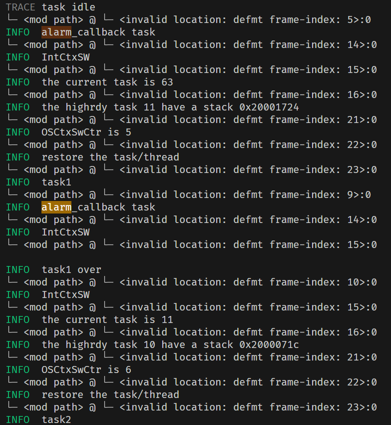

# 周报

​	

## 3-10 ~ 3-14

有个棘手的问题，个人理解组件化是将调度器内核最小化，以至于最小化都能运行，后面进行扩展也只需要添加新的组件。但是对于RTOS来说，或者对这个项目来说，功能上已经相对完善，耦合性也较高。需要依赖堆栈的内存分配去管理任务栈，依赖定时器实现时钟戳以及闹钟，依赖时钟队列管理延时任务等。

组件化在于如何在最小化内核的同时，仍然保持系统的可扩展性和模块的独立性

这一阶段计划：

- 将内核最小化，分离与内核关联不大的代码，以组件的形式独立。
  - 不再采用ucosii的代码结构
- 目前仅支持stm32f401，需要往多处理适配
  - 启动内核外设方式不同，需要统一接口
  - 需要解决memory.x链接脚本问题
  - 时钟问题，定时器是由系统时钟提供的时钟信号，需要确定每款芯片的时钟


Qemu去验证不同芯片下的可行性

​	

### memory.x解决方案

因为不同芯片有不同大小的FLASH和RAM，所有链接器所需要的 `memory.x` 也不同。有两种方案：

- 根据芯片类型去生成对应的`memory.x`，就跟embassy一样，embassy-stm32的构建脚本build.rs，会识别用户传过去的`feature`去生成 `memory.x` 。
- 另一种就是用户自行添加所用芯片的 `memory.x` 

但我看到`stm32-metapac`提供接口，可以自动生成`memory.x`，原理应该第一种差不多

但目前我没有去验证其他芯片，是否会正确生成

​	

### Question


https://rustcc.cn/article?id=04fbf832-0395-49dc-ab60-ef4496a34060

在一个 `no_std` 环境中使用了 `panic = "unwind"`，而 `no_std` 环境不支持栈展开（unwinding）。Rust 的标准库 (`std`) 提供了栈展开的支持，但在 `no_std` 环境中，默认情况下只能使用 `panic = "abort"`

设置 `panic = "abort"`：

```
[profile.dev]
panic = "abort"

[profile.release]
panic = "abort"
```

但是没必要，这里报错归根到底是因为我cargo build没有指定平台 `thumbv7em-none-eabi` 导致的，会配置隐式地支持 `panic = "abort"`

​	

## 3-17 ~ 3-21

目前已经大致完成芯片架构扩展，不再单一支持F401

#### 时钟树配置

RCC的初始化需要对锁相环PLL配置，但纵使所有芯片的HSE都为8M，一旦需要的系统时钟不同，那么PLL锁相环参数M、N、P、Q也是不同的。

目前，尚未实现统一的接口来抽象时钟树配置。与 **Embassy** 等框架提供的完整 STM32 外设接口相比，需要手动配置时钟树

用于定义内存布局`memory.x` 通过 **stm32metapac** 提供的接口动态生成 `memory.x`，确保其与目标芯片的内存布局一致。

#### 定时器

定时器，需要解决的是如何获取系统时钟。然而，**stm32metapac** 并未像 **stm32-hal** 那样提供直接获取时钟频率的接口。为了解决这一问题，设计了专用的函数来计算 `SYSCLK` 和 `APB` 总线的时钟频率。会在os初始化时被调用，以确保定时器能够基于正确的时钟频率运行

另外像 `embassy` 那样支持了通过 `feature` 设置定时的脉冲频率

#### 外设接口

为了支持更多 STM32 芯片，激活 **stm32metapac** 的关于芯片的 `feature` 实现。编译时启用特定芯片的 `feature`，可以动态加载对应芯片的外设寄存器定义和访问接口。

​	

同时展开对ucos底层函数的重写

#### 全局分配器（Global Allocator）的实现

在之前的实现中，系统并不支持像`String`，`Vec`这种动态大小的类型。需要完成 `global allocator` 的实现。

之前实现栈分配器的时候，也是对堆内存进行分配。采用的是 linked list allocator 链式分配器的方案来管理堆内存。链式分配器通过维护一个空闲内存块的链表，动态分配和释放内存。

由于使用了 `flip-link` 链接器，`.data` 和 `.bss` 段被放置在地址空间的高位，所以可以在任务栈之后开辟了一块专用的堆内存区域，供全局分配器使用


另外完成了部分关于ucos中os_core和os_task的重写工作

​	

## 3-24 ~ 3-28

本周主要完成 ucosii 中全局变量的设置以及对os_core、os_task、os_time中的部分函数进行重写。


### 全局变量

- `OSIntNesting`，中断嵌套数
- `OSLockNesting`，调度锁的个数

为了能对调度器进行加锁以及避免中断嵌套中切换任务，`ucosii` 其实是通过`OSIntNesting`和`OSLockNesting`两个全局变量完成的。`OS_Sched`会去判断这两个变量是否为0，都为0时才会去调度新的任务。`ucosii` 是通过SysTick中断每隔几ms去检查优先级位图是否需要进行切换，也就是不断轮询看是否切换，但是 `embassy_preempt` 整个调度过程是线性的，因为引入了rust的协程以及事件唤醒机制。如果像 `ucosii` 一样直接在调度器代码中根据这两个全局变量判断是否切换的话，可能不太现实。在调度器代码中加入调度锁，代码就大概率不会往下运行，因为调度器是线性执行的，它必须确保能切换到任务。

换个思路，一般使用调度锁，是不想被其他任务打断。也就是说，在任务运行中，有更高优先级的任务被唤醒，调用了闹钟的回调函数，加入了就绪队列，按以往不加锁的话会通过 `IntCtxSW` 判断优先级是否高于当前优先级，后续会转入调度器代码，切换到最高任务。那么是否可以直接在 `IntCtxSW` 中引入调度锁，不必像 `ucosii` 一样在轮询方式的调度器内核中加入调度锁。这样不会导致os卡死，加锁后仍然可以用过解除调度锁来通过` IntCtxSW` 再次进入调度器代码中。

#### 验证

配置两个任务，task1优先级位11，task2优先级为10，task1任务体中有一个延时操作（延时函数只是用汇编写的循环，并不会主动释放控制权）

```
fn task1(_args: *mut c_void) {
    loop {
        // OSSchedLock();
        #[cfg(feature = "alarm_test")]
        info!("task1");
        delay(4);   // 2s
        #[cfg(feature = "alarm_test")]
        info!("task1 over");
        // OSSchedUnlock();
        OSTimeDlyHMSM(0, 0, 0, 500);
    }
}

fn task2(_args: *mut c_void) {
    loop {
        #[cfg(feature = "alarm_test")]
        info!("task2");
       
        OSTimeDlyHMSM(0, 0, 0, 500);
    }
}
```


下图是没有添加调度锁的日志输出：


可以看到，最初在执行IDLE任务，然后优先级11（task1）的任务被唤醒，进行一系列上下文切换过程。然后执行task1任务体的内容，直到红框部分，这标志此时有一个任务被唤醒，而且它的优先级为10（task2），它直接打断优先级11（task1）的任务，进行优先级抢占。


下图是在task1任务中添加调度锁的日志输出：



仍然是之前的场景，先在执行IDLE任务，然后优先级11（task1）的任务被唤醒。然后执行task1任务体的内容，直到高亮部分，表示有一个任务被唤醒，因为就只创建了两个任务，所以被唤醒任务的优先级为10（task2）。可以看到执行 `alarm_callback` 后调用 `IntCtxSW` ，此次没有进行任务切换，没有被更高优先级（10）任务打断，而是继续执行task1任务，“task1 over”后面接的 `IntCtxSW` 是` OSSchedUnlock()` 中的。总上，调度锁算是完成了。

​	

- `OSCtxSwCtr`，任务切换的次数

`OSCtxSwCtr`这个全局变量，用来记录os启动之后，上下文切换的次数。

原本是将这个变量的递增代码放在 `IntCtxSW` 中，但是后面发现 `IntCtxSW` 只会任务被唤醒的时候才会被调用，那么从任务切换到IDLE任务时，进行的上下文切换不会被记录。为了能像ucosii一样，从IDLE切换到任务以及任务切换到IDLE，都进行计数器计数。将该部分代码移动到` interrupt_poll` 中，因为无论唤醒的任务还是IDLE切换，都需要执行这个方法。

经过再次分析后，` interrupt_poll` 会出现同一切换，自增两次的情况。将其自增代码移动到 `PenSV` 里，原因下面会提到


### 问题


在验证调度锁时，发现一个问题：IDLE任务后恢复优先级10任务上下文，但执行到“restore the task/thread”这一步（这步会触发PenSV异常，进行上下文切换，也就是在最后一步前被中断，丢失了从alarm_callbask到restore the task/thread的工作），立马再次alarm_callback task，也就是说IDLE切换到优先级10任务的过程中，有一部分代码没有在临界区，此时时间戳更新，另一个任务（task1，优先级11）也被唤醒了，但是优先级没有task2高，所以又重新进行对task2进行上下文的切换。导致重复执行了调度器的部分内容，而且会多余地增加一次OSCtxSwCtr。但是如果调度器代码全部呆在临界区里，又会影响到实时性，推进os运行的时间戳会被延迟，需要等到出临界区才能更新（其实这个问题就是推进时间戳的中断照成的），也就是恢复完任务的上下文，在任务体中。

经过分析，个人还是不要将调度器代码全部放在临界区。上面的情况是恢复高优先级任务时，出现的重复。假设在恢复一个低优先级任务，且调度器全在临界区，恢复过程中有一个高任务需要被唤醒，但现在中断被关，无法响应，需要等到低优先级任务恢复完上下文后，再响应中断再次触发PenSV切换上文。这种情况下，导致的开销会比不全在临界区的大，因为进入了两次PenSV。

​	

## 3-31 ~ 4-4

重写OSTaskDel：

- 回收或释放OS_TCB
  - Arean,future,OSTCBRegTbl
- 删除Alarm
- 回收任务栈

1、`OSTCB` 以及 `Future` 是被封装成 `OS_TASK_STORAGE` ，调用任务创建OSTaskCreate函数时底层其实是创建并初始化`OS_TASK_STORAGE`，通过全局静态变量 `AREAN` 分配，`AREAN` 是基于 `MaybeUninit` 的线性分配器。但是`OS_TASK_STORAGE` 会被分配到 `.bss` 段（0x200151d0起始，每个`OS_TASK_STORAGE` 占用128字节）。

已知 `.bss` 段是编译器编译时就分配好的，无法被运行时时释放或回收。不过好在目前最多只支持运行64个任务，尽管 `AREAN` 是后进先出的分配器，也能满足 64*128 字节的需求。故不做回收，仅仅清零该任务控制块所占的 `.bss` 段

​	

2、回收 `alarm`。异步任务需要事件机制唤醒，而实施唤醒是通过向时钟队列注册Alarm，任务延时到达后，将执行回调函数唤醒任务。原本认为需要回收已经设置好的 `alarm` ，但并不是每个任务延时都会去创建 `alarm` ，而是通过时钟队列，弹出最近到达的任务去注册`alarm`。那么就比较好办了，只需要检查是否在时钟队列里，在则移出。

但是如果该任务已经注册了`alarm`，而且这个`alarm`没有到达。是否需要去删除这个`alarm`？

- 不删除。删除的任务注册的alarm会去执行回调函数，注册新的alarm并寻找最高优先级。有两种情况：
  - 就绪队列有更高优先级任务，那么会切换到最高优先级。但是此情况不会发生，因为如果就绪队列有更高优先级任务，肯定是在该alarm到达之前就已经加入了，而且一定会切换到最高优先级任务，还轮不到该alarm到达时才切换。
  - 所以该alarm达到时，一定是没有最高优先级任务的，除非一种比较极端的条件下，就是其他任务与该删除的任务拥有相同的达到时间。更多情况下，该alarm到达执行了一次多余的操作。
- 删除。虽然说是通过任务的延时时间去注册的Alarm，但是alarm并不与任务进行绑定。要想删除alarm，需要通过任务延时时间去查找对应的alarm。但是如果删除的任务与另一个任务的延时到达时间相同，那么会误删对应的alarm，导致另一个任务无法被唤醒，直到有一个alarm到达，执行回调函数时才能有可能（有更高优先级时次任务仍然无法被唤醒）唤醒该任务。

​	

3、在对栈回收，是否需要判断是否有任务在运行，而且需要删除的任务是它自己？ucosii不用判断，是因为ucosii会在初始化时直接给每个任务分配一个指定大小的栈。而embassy_preempt不同，是有栈复用的，而且在PenSV进行上下文切换时需要切换任务栈，或换句话说，PenSV的上下文切换是依赖于任务栈的。任务栈是栈指针始终指向当前运行的任务。那么如果当前任务删除自身后，会进行上下文切换，保存的上下文仍会保存在之前已经释放的栈里（虽然保存的上下文已经没有意义了）。

删除任务函数有两种情况，当前任务删除自身，或者删除另一个任务。

- 当前任务删除自身，除了一系列退出就绪队列的操作，难点在于对于栈的回收。
  - 对于栈回收的时间谈论，如果在 `OSTaskDel` 时就释放了栈，那么触发 `PenSV` 进行上下文切换时，首先进行的上下文保存将访问释放的内存空间。所以将在 `PenSV` 里进行栈的回收，思路如下： `PenSV` 里程序栈会切换成最高优先级的栈，弹出旧站即当前任务的栈，那么是否可以在此处释放栈
- 删除另一个任务，对于栈回收
  - 一旦删除该任务，并会退出就绪队列，并且会清除优先级表的该优先级‘指针。是无法在 `PenSV` 里去释放栈空间的，因为根本切换不到该任务，故在 `OSTaskDel` 里完成栈的释放。


这是整个系统的流程图，大致描述了系统是如果完成任务调度的。OSStart会分配程序栈和中断栈，`poll`、`single_poll`会去执行最高优先级任务直到任务**释放控制权**，调用 `OSTimeDly` 加入时钟队列，并找到最高优先级任务，然后执行 `interput_poll`给新任务分配栈，完成任务堆栈初始化，从STK中恢复上下文，触发PenSV保存上下文。比较巧妙的是，执行完PenSV的逻辑，恢复的上下文中PC值被设定为进行模拟压栈时压入的 `executor_function_ptr` 闭包的地址，这个闭包会去调用再次 `single_poll`，这样就可以保证在切换后，会进入调度器的代码逻辑。另外`executor_function_ptr` 中`single_poll` 后面还有`poll` 方法，但是不会执行。**总的来说，整个系统的推进依赖于`single_poll`与`interuput_poll`两个调度器的方法**

 `os_core.rs` 中关于中断进入退出函数，将统一使用全局调度器的`IntCtxSW`接口

