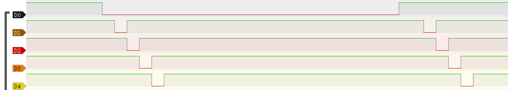
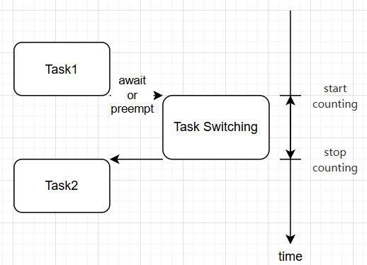

# 性能测试

RTOS的实时性能的主要评测指标包括实际延迟时间，上下文切换时间

​	

### 1、实际延迟时间

> 验证任务延迟函数的精度和系统实时响应能力

​	

#### 逻辑分析仪测试方案

测试任务用Task表示，Task[i]表示第i个正在运行的任务。这里创建5个异步任务，模拟多任务执行环境。

Task1用于LED的闪烁，Task2~Task5的任务体会分别在开始与结束拉高拉低PA4、PA6、PA7、PA8，最后延迟500ms。优先级递减。同时各个任务间的切换是从Task1开始，到Task5，这样一直切换下去，最后再从Task5切换到最开始的任务TASK1。

如下是RTOS启动后各任务执行情况，D0对应Task1，D1对应Task2以此类推。



**使用逻辑分析仪捕获GPIO波形**

以50ms的延时为标准，通过测量持续高电平来间接测试实际延迟时间：

| 测试轮次 | Task1 (LED) | Task2 (PA4) | Task3 (PA6) | Task4 (PA7) | Task5 (PA8) |
| -------- | ----------- | ----------- | ----------- | ----------- | ----------- |
| 1        | 50.05       | 50.08       | 50.12       | 50.16       | 50.20       |
| 2        | 50.03       | 50.06       | 50.11       | 50.14       | 50.18       |
| 3        | 50.07       | 50.09       | 50.13       | 50.17       | 50.22       |
| 4        | 50.02       | 50.05       | 50.09       | 50.13       | 50.16       |
| 5        | 50.06       | 50.10       | 50.14       | 50.19       | 50.23       |
| 6        | 50.04       | 50.07       | 50.10       | 50.15       | 50.17       |
| 7        | 50.08       | 50.11       | 50.15       | 50.20       | 50.25       |
| 8        | 50.01       | 50.04       | 50.08       | 50.12       | 50.15       |
| 9        | 50.09       | 50.12       | 50.16       | 50.21       | 50.26       |
| 10       | 50.05       | 50.08       | 50.11       | 50.14       | 50.19       |

​	

| 指标      | Task1  | Task2  | Task3  | Task4  | Task5  |
| --------- | ------ | ------ | ------ | ------ | ------ |
| 平均值    | 50.050 | 50.080 | 50.120 | 50.161 | 50.201 |
| 最大值    | 50.09  | 50.12  | 50.16  | 50.21  | 50.26  |
| 最小值    | 50.01  | 50.04  | 50.08  | 50.12  | 50.15  |
| 标准差(σ) | 0.027  | 0.025  | 0.026  | 0.030  | 0.036  |

​	

#### 定时器测试方案

以上的测试结果均是使用逻辑分析仪去测量电平的持续时间来测量时间的，比较麻烦。后改用定时器来测量，使用的是TIM4定时器，频率设置为84MHz，也就是1/84us进行一次自增。

测试代码：

```
fn task(_args: *mut c_void) {
    loop {
        time_set();		// 定时器TIM4清零

        OSTimeDly(50 * 100);

        #[cfg(feature = "alarm_test")]
        info!(time4's cnt is: {:?}", time_get());	// 获取任务重新被唤醒，继续执行时的定时器计数值
    }
}
```

**原理：**创建三个任务，同时测量实际延迟时间，测量多次结果，最后求平均值。

**注意：** 需要减去主动让CPU执行时间；另外本人发现日志输出也有一定的时间开销，需要考虑进去

**时间计算公式：**

- measurement_time：测量的延迟时间
- task_delay_time：任务延迟时间
- log_output_time：日志输出时间

$$
time = measurement\_time - task\_delay\_time - log\_output\_time
$$

日志输出时间的测量：连续数条定时器计数值获取代码，测量差距，并取平均值

三个任务均延迟50ms，最后测量出来三个任务实际延迟时间的平均值为：

**50.11ms**

​	

结论：embassy_preempt可抢占，实时性高，基本符合嵌入式实时操作系统对实时性的要求。

​	

### 2、调度时间（上下文切换）

> 测量任务切换过程中的时间开销

OS在两个独立的、处于就绪态的任务之间切换所需要的时间。具体操作主要包括三个部分，**保存当前任务上下文的时间、调度程序选中新任务的时间和恢复新任务上下文的时间**，当然这是传统RTOS线程任务的上下文，不会涉及到协程的栈空间释放，协程的切换时间理论上会长。

另外，切换所需的时间主要取决于**保存任务上下文所用的数据结构、操作系统采用的调度策略，以及调度器程序栈的切换协程栈的释放**等。产生任务切换的原因可以是优先级抢占、任务主动释放控制权。

任务切换过程增加了应用程序的额外负荷。CPU的内部寄存器越多，额外负荷就越重。任务切换所需要的时间取决于CPU有多少寄存器要入栈。实时内核的性能不应该以每秒钟能做多少次任务切换来评价，而是测试一次任务切换产生的时间开销。

​	

主要有保存当前任务上下文的时间，调度程序选中新任务的时间和恢复新任务上下文的时间这三部分组成。下图给出了两个任务切换过程的示意图



该测试中将**测试 `IntCtxSW` 到 `PenSV` 完成上下文切换的时间**，`IntCtxSW` 是进行调度逻辑的入口，高优先级任务唤醒后会调用该函数，所以从此处开始测量，然后会经过一系列操作，进入PenSV软中断中，进行上下文切换等操作，直到切换到高优先级。

#### 关键测量点

1. IntCtxSW（调度入口）到PendSV开始
2. PendSV执行全过程

仍然是采用逻辑分析仪来测量从IntCtxSW到PenSV之间的电平持续时间。

注意：IntCtxSW并不一定会执行到PenSV完成上下文切换，因为当低优先级任务唤醒，执行闹钟回调函数，随后会转去执行IntCtxSW，但不会进行抢占，所以不会进行上下文切换。所以会出现只执行了IntCtxSW不进行上下文切换的情况。

| 测试轮次 | embassy_preempt |
| -------- | --------------- |
| 1        | 7.005us         |
| 2        | 6.5us           |
| 3        | 7.007us         |
| 4        | 7.002us         |
| 5        | 7.03us          |
| 6        | 6.45us          |
| 7        | 7.503us         |
| 8        | 7.004us         |
| 9        | 7.008us         |
| 10       | 6.501us         |
| avg      | 6.901us         |

结论：从测试结果可以看到，会出现6.5us，7us，7.5us的情况，因为逻辑分析仪只能分析电平信号，不知道实际执行内容。所以个人分析，这部分的差异主要是不同任务切换产生的差异，如线程切线程，线程切协程，协程切线程

​	

### 定时器测试方案

使用的是TIM4定时器，频率设置为84MHz，也就是1/84us进行一次自增。仍然对以下测试点进行测试：

1. IntCtxSW（调度入口）到PendSV开始
2. PendSV执行全过程


在 `IntCtxSW` 开始将定时器计数值置为0，在 `PenSV` 完成上下文切换后读取计数值。统计多轮数据，得到如下结果：

- 有栈任务切换到有栈任务
  - 线程切换到线程：上下文切换的时间开销取平均值为 **3.5952us**
  - 协程切换到线程：因为会对协程进行栈回收，会产生栈销毁的时间开销，这部分栈的开销测量取平均值是 **0.83us**，上下文切换的时间开销取平均值为 **4.4285us**
- 有栈任务切换到无栈任务（线程切换到协程）：会在 `interrupt_poll` 完成栈的分配以及初始化，这部分栈的开销测量取平均值是 **0.2619us**，上下文切换的时间开销取平均值为 **3.8571us**

​	

结论：测试结果，上下文切换的时间开销在**3.8us**左右。可以看到使用定时器测试的结果与用逻辑分析仪测试的结果是有差别的，相差了几us，按理说测试点都是一致的，结果应该差不了多少。个人分析是仪器的误差，或者定时器的误差

​	

### 3、中断响应时间

中断延迟时间是指从接收到中断信号到操作系统做出响应，并完成进入中断服务例程所需要的时间。多任务操作系统中，中断处理首先进入一个中断服务的总控程序，然后才进入驱动程序的ISR。

中断响应时间＝最大关中断时间＋硬件开始处理中断到开始执行中断服务例程第一条指令之间的时间。

硬件开始处理中断到开始执行中断服务例程的第一条指令之间的时间由硬件决定，所以，中断延迟时间的长短主要取决于最大关中断的时间。

- **原理：**创建一个任务，任务执行主动触发中断，执行完中断服务程序返回，统计其时间。

- **具体流程：**任务体触发软中断，并将定时器计数值置零，在中断里读取计数值，完成时间测量。

```
// 任务
fn task(_args: *mut c_void) {
    loop {
        EXTI0_Interrupt();		// EXTI0

        OSTimeDly(50 * 100);
    }
}

// 中断服务程序
pub extern "C" fn EXTI0() {
	#[cfg(feature = "alarm_test")]
    info!(time4's cnt is: {:?}", time_get());	// 获取定时器计数值
}
```

​	

经过多轮测试，中断响应的时间开销取平均值为 **1.047us**

​	

### 测试时发现的问题

使用定时器测试的时候发现，

```
#[cfg(feature = "alarm_test")]
        {
            info!("the current task is {}", *self.OSPrioCur.get_unmut());
            // info!("alloc stack for the task {}", *self.OSPrioHighRdy.get_unmut());
        }
```

有将近19us的开销。发现使用日志输出会产生性能开销，而且时间开销不固定，有些日志输出达到了30、40us的开销，非常影响测试结果。

将测试过程中所有所涉及的日志输出注释掉，只保留定时器的日志输出，再进行测试
